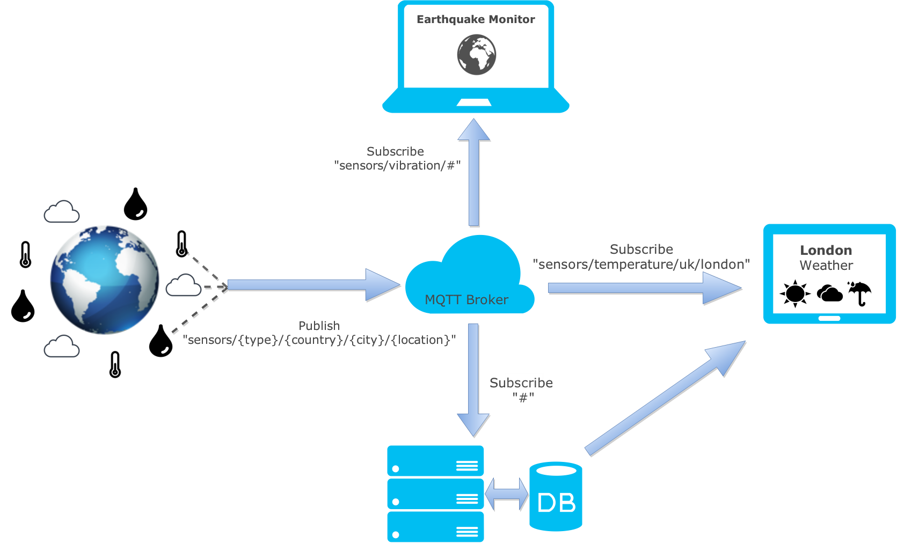

# Collecting, Extracting & Storing CTT sensor data

## What does it do?

This combination of Python modules and scripts are used to store in real-time any measurement sent by CTT devices measuring air quality in Trondheim (Norway) and Vejle (Denmark). 


## How does it work?

The main tasks consist in:

* collecting the MQTT messages sent by each device to the gateway through an MQTT broker provided by [TheThingsNetwork](https://www.thethingsnetwork.org/).
* extracting the useful values/measurements generated by the sensors from the compressed/encrypted payload of those messages.
* store this useful data in the database system. This also means:
    * creating automatically any new column in the database's table(s) for any new sensor detected.
    * adding any new data entry to its respective table.


Finally we also added the ["crontab" commands ](./watchdogs) to work as watchdogs for restarting the collection if the process is not detected as running anymore.

If the main script ([`collectSensorDataCTT.py`](./collectSensorDataCTT.py)) is runned for the first time on a fresh MonetDB database, 

* It first create the tables in the MonetDB database,
* then it used to read the historical sensor data from TheThingsNetwork REST API which was deprecated in August 2016, and store them in MonetDB,
* for every new type of sensor appearing in the sensor's payload, a new column in MonetDB is automatically created. This allows for a highly dynamic intake of any new sensor.
* finally an infinite loop waits for any single new MQTT message sent by the sensors and stores each one in the database as well.

## Building your own air quality data  collection

### Getting started with MQTT and listening to MQTT messages

In _CTT 2.0_ the MQTT messages are captured by gateways connected to [_The Things Network_](https://www.thethingsnetwork.org).

The MQTT protocol allows any device to send MQTT messages to a MQTT Broker (in this case _The Things Network_) whose task is to redistribute copies of each message to the subscribers of any topic that includes that device (as shown on the sketch below).

.

This source code contains ways to collect the MQTT message using the python package "Paho", but you can test your MQTT broker by using [Mosquitto](https://mosquitto.org/man/mosquitto_sub-1.html) to fetch ("to subscribe to") incoming messages as they arrive:

```shell
mosquitto_sub -h staging.thethingsnetwork.org -p 1883 -u 70B3D57ED0000AD8 -P LJtFqN8NSqHQzDaaZkHVQ+G+KCDJ+fZbptl94NyUXGg= -t 70B3D57ED0000AD8/devices/+/up 
```

In the command line example above, we connect to the MQTT broker hosted by **"staging.thethingsnetwork.org"**, on port **"1883"** with user/password identified by the **-u** and **-P** options with topic(s) on the form **"70B3D57ED0000AD8/devices/+/up"**.

This topic actually matches any topic which starts by **"70B3D57ED0000AD8/devices/"** and finishes by **"/up"**.


### Understanding the Libelium payload format and extracting useful measurements

[Libelium](http://www.libelium.com/) provides _arduino_-based devices equipped with communication capabilities and various types of sensors. In this project, the MQTT messages include a payload with the measurements of the sensors.

The order of the measurements in the payload is chosen by CTT when configuring the device. Here is an example of _arduino_-based code showing it:

```C
frame.createFrame(BINARY);
frame.addSensor(SENSOR_GP_CO2, co2concentration);
frame.addSensor(SENSOR_GP_NO2, no2concentration);
frame.addSensor(SENSOR_GP_TC, temperature);
frame.addSensor(SENSOR_GP_HUM, humidity);
frame.addSensor(SENSOR_GP_PRES, pressure);
if(PMX == true){
      frame.addSensor(SENSOR_OPC_PM1, OPC_N2._PM1);
      frame.addSensor(SENSOR_OPC_PM2_5, OPC_N2._PM2_5);
      frame.addSensor(SENSOR_OPC_PM10, OPC_N2._PM10);
} else {
      frame.addSensor(SENSOR_OPC_PM1, -1);
      frame.addSensor(SENSOR_OPC_PM2_5, -1);
      frame.addSensor(SENSOR_OPC_PM10, -1); 
}
frame.addSensor(SENSOR_BAT, battery);
frame.showFrame();
char data[frame.length*2 + 1];
Utils.hex2str(frame.buffer, data, frame.length);
```

Most configurations of the sensors were also [shared here on Github](https://github.com/fredrikva94/CTT/tree/master/PSSEP).

Once the measurements concatenated in the binary frame, the payload is compressed in hexadecimal, then in base 64 to optimize the size of the MQTT message.

The Python module [**CTT_Nodes.py**](./CTT_Nodes.py) extracts the Binary Frame from Libelium and returns the measurements in a dictionary.

It can extract data from the payload compressed in base 64, e.g.:

```shell
ctt_data_collection$ python ./CTT_Nodes.py -h
usage: CTT_Nodes.py [-h] [-hex BASE16 | -b64 BASE64] [-f FILE_PATH] [-v]

optional arguments:
  -h, --help            show this help message and exit
  -hex BASE16, --base16 BASE16
                        Read and Extract payload from a message in
                        hexadecimal, such as 3c3d3e002866155818544b43545430322
                        3778ff596d1438900000000903d0a03419200b6b142935a6fc8473
                        428
  -b64 BASE64, --base64 BASE64
                        Read and Extract payload from a message in base64,
                        such as PD0+ADdk4lcYVkpDVFQwMSNgj0hmtUOJAAAAAJD2KJpBko
                        DlkUKTsATGR5fJMoU/mKRU8j+Z4BE5QDRa
  -f FILE_PATH, --file_path FILE_PATH
                        Input file to read data from to be store in DB,
                        formatted as dictionaries on each line.
  -v, --verbose         increase output verbosity

ctt_data_collection$ python ./CTT_Nodes.py -b64 PD0+ADdk4lcYVkpDVFQwMSNgj0hmtUOJAAAAAJD2KJpBkoDlkUKTsATGR5fJMoU/mKRU8j+Z4BE5QDRa
{'SENSOR_BAT': 90,
 'SENSOR_GP_CO2': 362.799072265625,
 'SENSOR_GP_HUM': 72.9482421875,
 'SENSOR_GP_NO2': 0.0,
 'SENSOR_GP_PRES': 101385.375,
 'SENSOR_GP_TC': 19.270000457763672,
 'SENSOR_OPC_PM1': 1.0406123399734497,
 'SENSOR_OPC_PM10': 2.8917160034179688,
 'SENSOR_OPC_PM2_5': 1.8932080268859863}
ctt_data_collection$
```

or extract data from the payload compressed in hexadecimal (base16), e.g.:

```shell
ctt_data_collection$ python ./CTT_Nodes.py -hex 3c3d3e002866155818544b435454303223778ff596d1438900000000903d0a03419200b6b142935a6fc8473428
{'SENSOR_BAT': 40,
 'SENSOR_GP_CO2': 419.1793518066406,
 'SENSOR_GP_HUM': 88.85546875,
 'SENSOR_GP_NO2': 0.0,
 'SENSOR_GP_PRES': 102622.703125,
 'SENSOR_GP_TC': 8.1899995803833}
ctt_data_collection$
```


### Creating your _MonetDB_ database

Once you can:

* check that you receive MQTT message using Mosquitto
* check that you can extract sensors' measurements

it may become interesting to store the data.

We choose **[MonetDB](https://www.monetdb.org)** to do so.

Please refer to their [documentation to install MonetDB](https://www.monetdb.org/Documentation/Guide/Installation).

#### Create one MonetDB instance

Login as root to create the instance, e.g. *mydbfarm* under _/home/_ directory:

```shell
# monetdbd create /home/mydbfarm/
# monetdbd start /home/mydbfarm/
# monetdb create ctt
# monetdb release ctt
```

#### Connect to your _MonetDB_ instance using **mclient**

Note: the initial password for the "monetdb" username is also "monetdb".

```shell
# mclient -u monetdb -d ctt
`password:
Welcome to mclient, the MonetDB/SQL interactive terminal (Jun2016)
Database: MonetDB v11.23.3 (Jun2016), 'mapi:monetdb://Jarvis:50000/ctt'
Type \q to quit, \? for a list of available commands
auto commit mode: on
sql>
```
#### Create a new user/password for your database

The new user is given his own schema for the MonetDB database. First connect the instance using **mclient** and the default "monetdb" username, then create a new schema and by specifying your new username and password.

```shell
sql>CREATE USER "co2" WITH PASSWORD 'ctt' NAME 'My new database' SCHEMA "sys";
sql>CREATE SCHEMA "co2" AUTHORIZATION "co2";
sql>ALTER USER "co2" SET SCHEMA "co2";
sql>\q
```
Then you should be able to connect to the MonetDB instance using your new username.

```shell
$ mclient -u co2 -d ctt
password:
Welcome to mclient, the MonetDB/SQL interactive terminal (Jul2015-SP1)
Database: MonetDB v11.21.11 (Jul2015-SP1), 'mapi:monetdb://numascale-r:50000/ctt'
Type \q to quit, \? for a list of available commands
auto commit mode: on
sql>
```


### Running the automated data collection

Now everything is ready to create the necessary tables in the database and launch the data collection by listening continuously to any incoming MQTT message.

Simply run the following command:

```shell
$ ./collectSensorDataCTT.py
```


