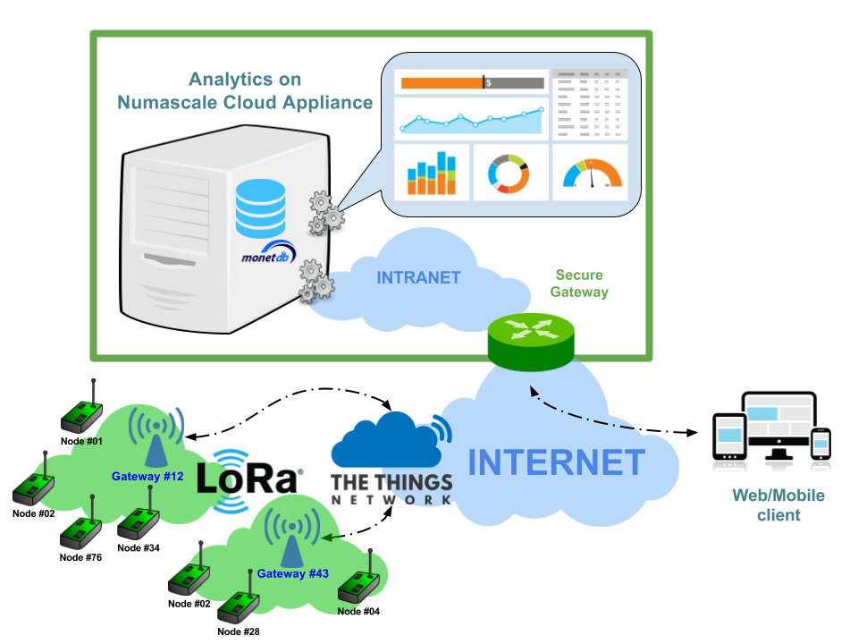

# Collecting, Extracting & Storing CTT sensor data

## What does it do?

This combination of Python modules and scripts are used to store in real-time any measurement sent by CTT devices measuring air quality in Trondheim (Norway) and Vejle (Denmark). 

## How does it work?

The main tasks consist in:

* collecting the MQTT messages sent by each device to the gateway through an MQTT broker provided by [TheThingsNetwork](https://www.thethingsnetwork.org/).
* extracting the useful values/measurements generated by the sensors from the compressed/encrypted payload of those messages.
* store this useful data in the database system. This also means:
    * creating automatically any new column in the database's table(s) for any new sensor detected.
    * adding any new data entry to its respective table.

Finally we also added the ["crontab" commands ](./watchdogs) to work as watchdogs for restarting the collection if the process is not detected as running anymore.

If the main script ([`collectSensorDataCTT.py`](./collectSensorDataCTT.py)) is runned for the first time on a fresh MonetDB database, 

* It first create the tables in the MonetDB database,
* then it used to read the historical sensor data from TheThingsNetwork REST API which was deprecated in August 2016, and store them in MonetDB,
* for every new type of sensor appearing in the sensor's payload, a new column in MonetDB is automatically created. This allows for a highly dynamic intake of any new sensor.
* finally an infinite loop waits for any single new MQTT message sent by the sensors and stores each one in the database as well.

## Building your own air quality data  collection

### Getting started with MQTT and listening to MQTT messages

### Understanding the Libellium payload format and extracting useful measurements

### Creating your _MonetDB_ database

### Running the automated data collection

